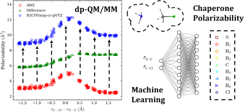

# predict-atmpol
Fortran code, which calculates the resulting gradients for molecular dynamics from the chaperone polarizabilities.

"Doubly Polarized QM/MM with Machine Learning Chaperone Polarizability," **Kim, B.**; Shao, Y.; Pu, J. J. Chem. Theory Comput. 2021, 17, 7682-7695 ([doi:10.1021/acs.jctc.1c00567](https://doi.org/10.1021/acs.jctc.1c00567); [PMID:34723536)](https://pubmed.ncbi.nlm.nih.gov/34723536/)).  



Author: Bryant Kim  
Email: brykimjh@gmail.com  
LinkedIn: https://www.linkedin.com/in/bryant-kim-1aba7522b/  
Website: https://wikipugr.sitehost.iu.edu/wiki/index.php?title=The_Pu_Research_Group  

Compile test.f90 with 0run.sh then run user.exe to create output.dat (updated dynamics):
```
$ bash 0run.sh
```

| File/Directory| Description   |
| ------------- | ------------- |
| ann.dat | artificial neural network which predicts atomic polarizabilities from geometry  |
| crd.txt | coordinates of qm/mm system  |
| force.txt | snapshot forces for crd.txt from a single step in molecular dynamics  |
| output.dat | output file containing updated forces from the chaperone polarizability corrections  |
| test.f90 | source code for dp-QM/MM correction  |
| user.exe | executeable for fortran code  |
